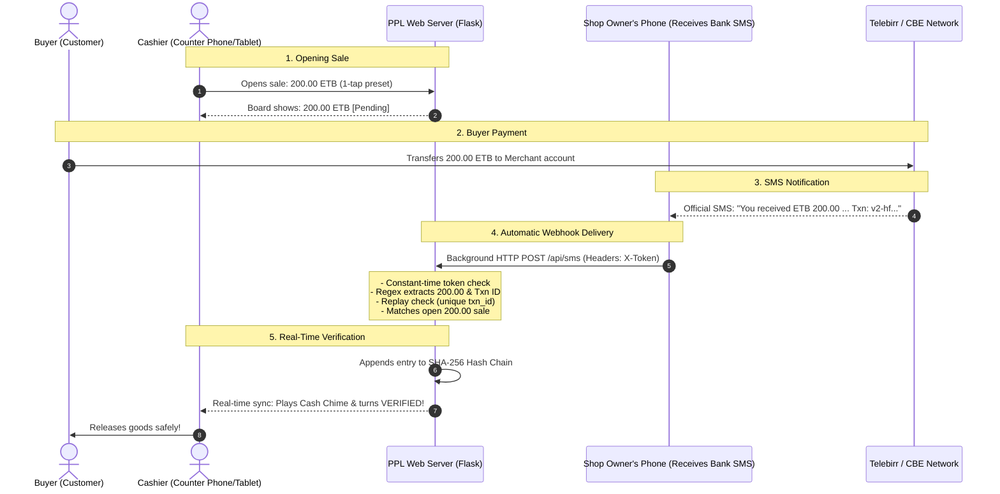
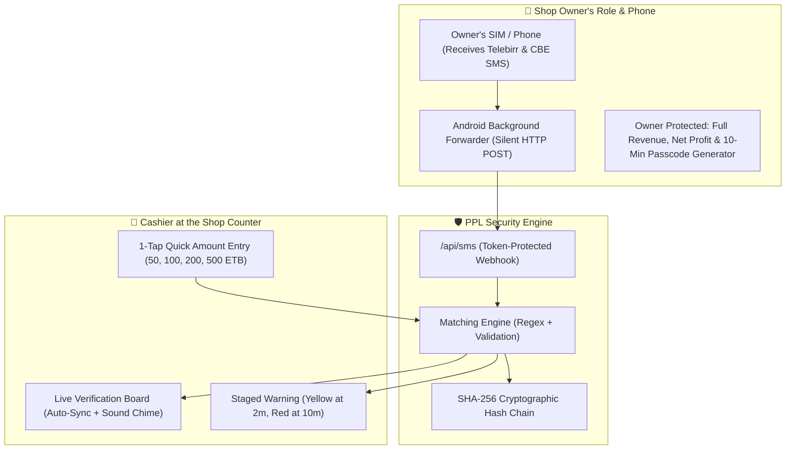

# System Architecture & Verification Flow

## 1. Cashier & Owner Flow with Automatic SMS Forwarding

```mermaid
sequenceDiagram
    autonumber
    actor Buyer as Buyer (Customer)
    actor Cashier as Cashier (Counter Phone/Tablet)
    participant PPL as PPL Web Server (Flask)
    participant OwnerPhone as Shop Owner's Phone (Receives Bank SMS)
    participant Bank as Telebirr / CBE Network

    Note over Cashier, PPL: 1. Opening Sale
    Cashier->>PPL: Opens sale: 200.00 ETB (1-tap preset)
    PPL-->>Cashier: Board shows: 200.00 ETB [Pending]

    Note over Buyer, Bank: 2. Buyer Payment
    Buyer->>Bank: Transfers 200.00 ETB to Merchant account

    Note over Bank, OwnerPhone: 3. SMS Notification
    Bank-->>OwnerPhone: Official SMS: "You received ETB 200.00 ... Txn: v2-hf..."

    Note over OwnerPhone, PPL: 4. Automatic Webhook Delivery
    OwnerPhone->>PPL: Background HTTP POST /api/sms (Headers: X-Token)
    Note over PPL: - Constant-time token check<br/>- Regex extracts 200.00 & Txn ID<br/>- Replay check (unique txn_id)<br/>- Matches open 200.00 sale

    Note over PPL, Cashier: 5. Real-Time Verification
    PPL->>PPL: Appends entry to SHA-256 Hash Chain
    PPL-->>Cashier: Real-time sync: Plays Cash Chime & turns VERIFIED!
    Cashier->>Buyer: Releases goods safely!
```

---

## 2. Separation of Responsibilities (FR-10)

```mermaid
flowchart TD
    subgraph Owner["👑 Shop Owner's Role & Phone"]
        OP["Owner's SIM / Phone (Receives Telebirr & CBE SMS)"]
        FWD["Android Background Forwarder (Silent HTTP POST)"]
        REP["Owner Protected: Full Revenue, Net Profit & 10-Min Passcode Generator"]
        OP --> FWD
    end

    subgraph Server["🛡️ PPL Security Engine"]
        API["/api/sms (Token-Protected Webhook)"]
        MATCH["Matching Engine (Regex + Validation)"]
        HASH["SHA-256 Cryptographic Hash Chain"]
        FWD --> API
        API --> MATCH
        MATCH --> HASH
    end

    subgraph Cashier["👤 Cashier at the Shop Counter"]
        DASH["Live Verification Board (Auto-Sync + Sound Chime)"]
        SALE["1-Tap Quick Amount Entry (50, 100, 200, 500 ETB)"]
        ALERT["Staged Warning (Yellow at 2m, Red at 10m)"]
        MATCH --> DASH
        SALE --> MATCH
        MATCH --> ALERT
    end
```
