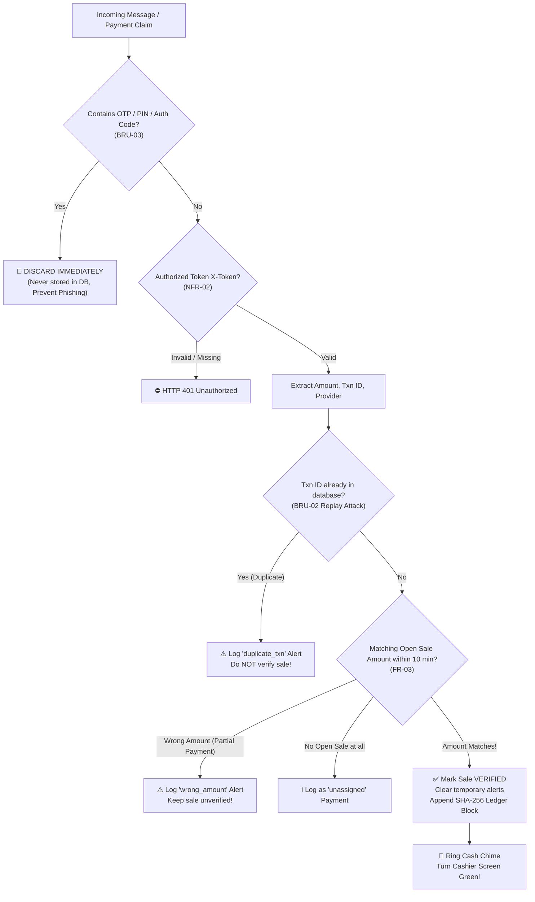
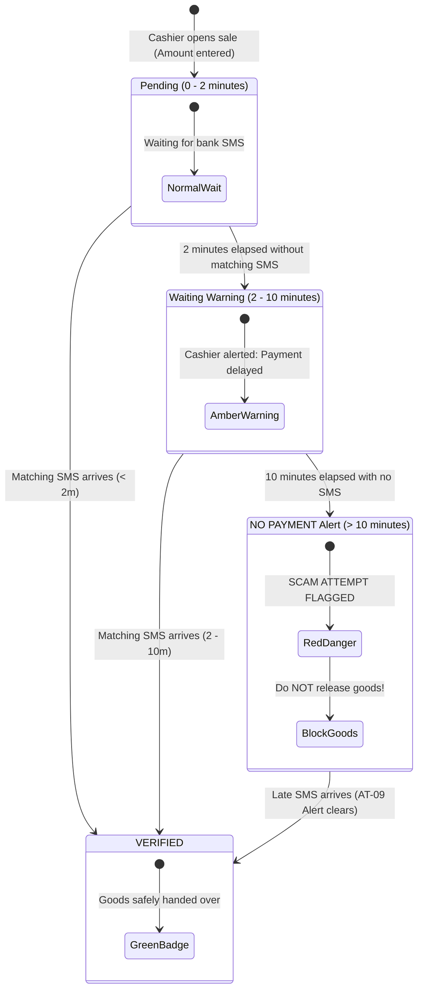

# Fraud Detection & Threat Workflow

```mermaid
flowchart TD
    Start["Incoming Message / Payment Claim"] --> CheckOTP{"Contains OTP / PIN / Auth Code?<br/>(BRU-03)"}
    
    CheckOTP -- "Yes" --> Discard["🚨 DISCARD IMMEDIATELY<br/>(Never stored in DB, Prevent Phishing)"]
    CheckOTP -- "No" --> CheckToken{"Authorized Token X-Token?<br/>(NFR-02)"}
    
    CheckToken -- "Invalid / Missing" --> Reject401["⛔ HTTP 401 Unauthorized"]
    CheckToken -- "Valid" --> ParseMsg["Extract Amount, Txn ID, Provider"]
    
    ParseMsg --> CheckReplay{"Txn ID already in database?<br/>(BRU-02 Replay Attack)"}
    
    CheckReplay -- "Yes (Duplicate)" --> LogDup["⚠️ Log 'duplicate_txn' Alert<br/>Do NOT verify sale!"]
    CheckReplay -- "No" --> CheckOpenSale{"Matching Open Sale Amount within 10 min?<br/>(FR-03)"}
    
    CheckOpenSale -- "Wrong Amount (Partial Payment)" --> LogMismatch["⚠️ Log 'wrong_amount' Alert<br/>Keep sale unverified!"]
    CheckOpenSale -- "No Open Sale at all" --> LogUnassigned["ℹ️ Log as 'unassigned' Payment"]
    CheckOpenSale -- "Amount Matches!" --> VerifySale["✅ Mark Sale VERIFIED<br/>Clear temporary alerts<br/>Append SHA-256 Ledger Block"]
    
    VerifySale --> Notify["🔔 Ring Cash Chime<br/>Turn Cashier Screen Green!"]
```

---

## Staged Timer Threat Workflow (Fake Buyer Defense)

```mermaid
stateDiagram-v2
    [*] --> Pending : Cashier opens sale (Amount entered)
    
    state "Pending (0 - 2 minutes)" as Pending {
        [*] --> NormalWait : Waiting for bank SMS
    }
    
    Pending --> Waiting : 2 minutes elapsed without matching SMS
    
    state "Waiting Warning (2 - 10 minutes)" as Waiting {
        [*] --> AmberWarning : Cashier alerted: Payment delayed
    }
    
    Waiting --> Alert : 10 minutes elapsed with no SMS
    
    state "NO PAYMENT Alert (> 10 minutes)" as Alert {
        [*] --> RedDanger : SCAM ATTEMPT FLAGGED
        RedDanger --> BlockGoods : Do NOT release goods!
    }
    
    Pending --> Verified : Matching SMS arrives (< 2m)
    Waiting --> Verified : Matching SMS arrives (2 - 10m)
    Alert --> Verified : Late SMS arrives (AT-09 Alert clears)
    
    state "VERIFIED" as Verified {
        [*] --> GreenBadge : Goods safely handed over
    }
```
